# GrahaOS

> *A from-scratch x86_64 operating system designed as an AI-native substrate.*

<p align="center">
  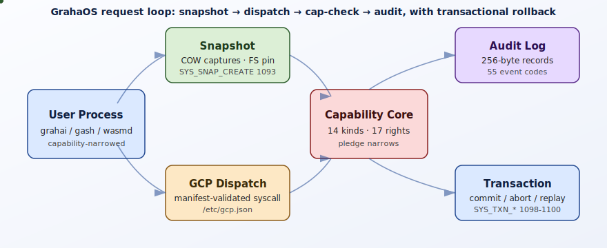
</p>

[](https://www.youtube.com/watch?v=uivT1Bw1-l0 "GrahaOS Control Protocol overview")

---

## What GrahaOS Actually Is

GrahaOS is a **clean-room operating system written from the first commit for x86_64**, intended as a substrate on which AI agents can act safely. We did not start from Linux, BSD, MINIX, or seL4 — every line of the kernel, the userspace, the filesystem, the network stack, and the test harness was authored in this tree. The pitch is a single sentence: *the OS treats AI agents as unprivileged userspace processes, capability-narrowed and pledge-restricted, that can speculate freely against versioned filesystem state and roll back atomically when they're wrong.*

What that means in practice, as the system stands today:

- **Capabilities are the sole authority.** No `uid`, no `gid`, no `root`, no ambient access of any kind. Every syscall checks either a capability token (one of 14 kinds, with 17 distinct rights bits, generation-counted to detect use-after-revoke) or a pledge class (one of 14 monotonically narrowing classes inspired by OpenBSD pledge but composable with channel handle transfer). [`kernel/cap/`](kernel/cap/)
- **One public manifest.** [`/etc/gcp.json`](etc/gcp.json) declares every syscall, every channel message type, every audit event, and every capability kind/right. The kernel parses it, userspace reads it, the WIT generator (`scripts/gcp2wit.py`) produces WebAssembly Component-Model bindings from it, and the manifest_blob is exported to processes via `SYS_MANIFEST_EXPORT`. AI agents and human developers read the same document.
- **Speculation is a first-class primitive.** `SYS_SNAP_CREATE` (1093) takes a copy-on-write snapshot of process memory, FD state, pledge mask, and pinned filesystem versions; `SYS_TXN_BEGIN/COMMIT/ABORT` (1098–1100) wraps that into transactional regions where external channel sends are buffered and replayed on commit or discarded on abort. [`kernel/snap/`](kernel/snap/) [`kernel/txn/`](kernel/txn/)
- **Drivers drift outward.** The kernel keeps VMM, scheduler, interrupts, framebuffer, timer, and the capability/channel primitives. Everything else — AHCI (`ahcid`), e1000 NIC (`e1000d`), TCP/IP (`netd`), the WebAssembly host (`wasmd`) — runs in userspace and speaks the same channel protocol any other process does.
- **Verified by hand and by harness.** Every spec includes a `manual_verification` section with copy-pasteable shell commands and expected output. The kernel ships a TAP-1.4 test harness (`make test`) plus a `make test-sentinel-meta` target that exists specifically to prove the harness catches failures.

The full technical report is at [`docs/GRAHAOS-COMPREHENSIVE-REPORT.md`](docs/GRAHAOS-COMPREHENSIVE-REPORT.md). This README is the entry point.

---

## Why Not Just Bolt AI Onto Unix?

The pre-existing AI-OS attempts (Rutgers AIOS, MemGPT, agentic shells layered over Linux) start from POSIX and add a coordinator. GrahaOS argues that POSIX is precisely the wrong substrate for agentic execution:

- **Ambient authority.** A POSIX process inherits `uid` and the entire syscall surface; sandboxing is a retrofit (seccomp-bpf, namespaces, gVisor) and every retrofit ships its own CVE history. GrahaOS makes capability checks the *only* admission path.
- **No rollback primitive.** When a Unix agent does the wrong thing, you cannot undo it. ZFS/Btrfs snapshots are filesystem-only and do not capture process state. GrahaOS snapshots capture pages + FDs + pledge + FS pins atomically and restore them by reverting per-page PTE state, FD slots, and grahafs version chains.
- **No machine-readable interface.** POSIX is documented in prose. GrahaOS's `/etc/gcp.json` is the kernel's own declared interface; the kernel and userspace cannot disagree about what a syscall does.
- **Drivers are kernel-trusted.** A buggy driver on Linux takes down the kernel. GrahaOS drivers are Ring-3 processes; when `ahcid` dies, the kernel's `blk_client` reaps the channel, restores HBA state via the `ahci_restore_after_userdrv_death` substrate, and the next spawn picks up where the dead one left off.

These are concrete design decisions, not slogans.

---

## System Architecture

<p align="center">
  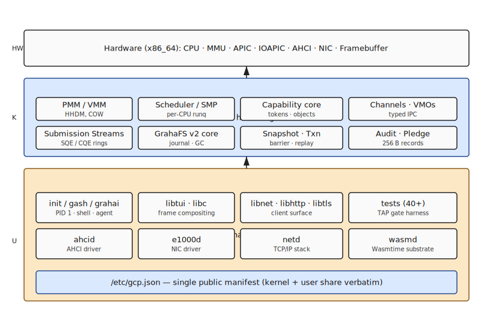
</p>

The kernel is a **modular monolith transitioning to a hybrid microkernel**. Boot path: Limine 9.3.3 hands off → `kmain` initialises PMM (bitmap with per-page refcount), VMM (PML4 walk via `g_hhdm_offset`), interrupts, LAPIC timer, SMP bring-up via INIT-SIPI-SIPI, capability core, channel registry, snapshot/transaction subsystems, audit, then forks `bin/init` (PID 1). `init` reads `/etc/init.conf`, spawns `ahcid`, `e1000d`, `netd`, and `wasmd` as capability-narrowed userspace daemons, then drops into `gash` (the GrahaOS shell) per the `autorun=` cmdline flag.

The seven design principles are non-negotiable; every spec in [`specs/`](specs/) must uphold at least two and violate none:

1. **Capabilities are the sole authority.** No ambient authority anywhere. Every syscall checks a capability token or a pledge class.
2. **GCP is the only native public interface.** Every syscall, channel message, and audit event has an entry in `/etc/gcp.json`.
3. **Foundation before migration.** New primitives ship before consumers move to them; old paths live briefly alongside as shims.
4. **Failure is auditable, not silent.** Panics dump structured oops frames; capability violations log subject/object/rights.
5. **Everything is testable by hand.** Every spec has a `manual_verification` section.
6. **Drivers drift outward.** AHCI, NIC, network stack, WASM host — all userspace.
7. **Speculation is a first-class AI primitive.** Snapshots + transactions + versioned FS, atomic.

---

## Subsystem Tour

### Capability Core

<p align="center">
  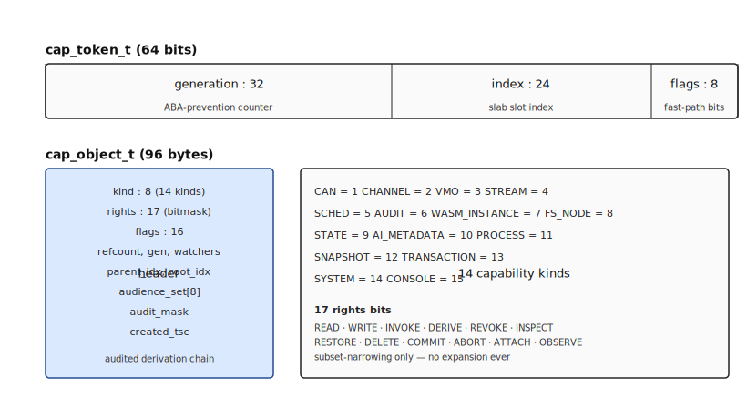
</p>

A `cap_token_t` is 64 bits — `gen:32 | idx:24 | flags:8`. The `idx` indexes a per-process handle table; the `gen` is incremented on revoke so a stale token resolves to a different `cap_object_t` and fails. `cap_object_t` is 96 bytes, holds the kind (one of 14: `CAN`, `MEMORY`, `CHANNEL_ENDPOINT`, `VMO`, `STREAM`, `WASM_INSTANCE`, `TRANSACTION`, `SYSTEM`, `SNAPSHOT`, `CONSOLE`, …), the rights mask (17 bits), the audience (up to 8 PIDs), and lock-free hot-path resolve via per-table generation. Rights compose by intersection on derive; `cap_object_derive_quiet` skips audit emission for inheritance walks. Source: [`kernel/cap/token.h`](kernel/cap/token.h), [`kernel/cap/object.c`](kernel/cap/object.c), [`kernel/cap/handle_table.c`](kernel/cap/handle_table.c).

Pledge is composable narrowing layered on top of capabilities: `SYS_PLEDGE` accepts a class mask that monotonically shrinks (you can never re-grant) plus an optional `wasm_pledge_narrow_args_t` that the kernel uses to narrow capabilities post-spawn for WebAssembly modules. 14 classes — `IPC_SEND`, `IPC_RECV`, `FS_READ`, `FS_WRITE`, `NET_BIND`, `NET_CONNECT`, `SPAWN`, `MMAP`, `SYS_CONTROL`, `SYS_QUERY`, `TIME`, `SIGNAL`, `EXEC`, `RANDOM` — with a `PLEDGE_MIN_ALLOWED` floor that keeps the process able to exit and emit audit records. [`kernel/cap/pledge.c`](kernel/cap/pledge.c)

### Capability Activation Network (CAN)

<p align="center">
  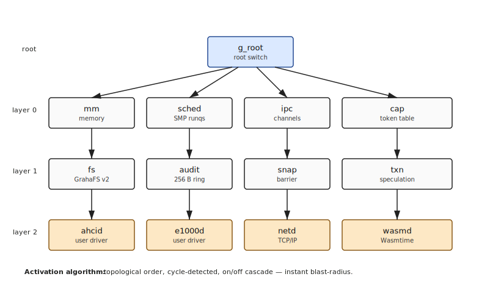
</p>

Every kernel subsystem registers as a *switch* in the Capability Activation Network — a directed dependency graph the boot path resolves with cycle detection (Lex → Resolve → TypeCheck → Cycles → Reachability → Optimize). Activating a switch cascades to its prerequisites; deactivating it cascades the other way. The full architecture is in [`ACTIVATION_ARCHITECTURE.md`](ACTIVATION_ARCHITECTURE.md).

### Channels & VMOs

<p align="center">
  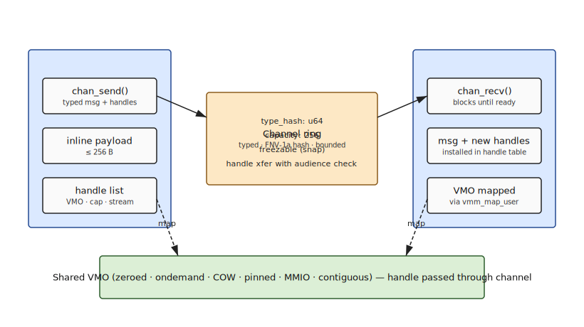
</p>

Channels are typed bidirectional IPC endpoints. Every message carries an FNV-1a 64-bit type-hash that is validated against the manifest at `chan_send` time — sending the wrong message type to a peer expecting a specific protocol is a kernel-side reject, not a userspace bug. Handles (capabilities, VMO maps, channel endpoints) ride inline with the message and are remapped into the receiver's address space by `chan_marshal_recv`. VMOs (Virtual Memory Objects) come in six flavours — `zeroed`, `ondemand`, `cow`, `pinned`, `mmio`, `contiguous` — with the COW path serving snapshots and the MMIO path serving userspace drivers. [`kernel/ipc/channel.c`](kernel/ipc/channel.c), [`kernel/mm/vmo.c`](kernel/mm/vmo.c)

### GCP — the Manifest as Single Public Interface

<p align="center">
  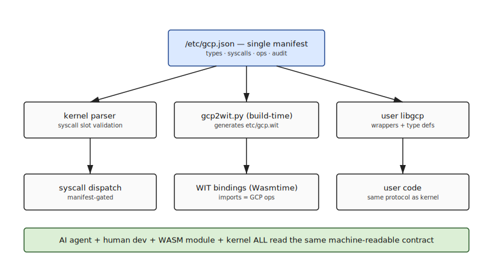
</p>

[`/etc/gcp.json`](etc/gcp.json) is the contract. It declares 100 syscall slots (1001–1100), 12 named channel services (`grahaos.wasm.service.v1`, etc.), 55 audit event codes, and the full capability ABI. The kernel embeds a hashed copy of it (FNV-1a 64-bit `gen` field) at build time via `scripts/gen_manifest_blob.py`; processes pull it back via `SYS_MANIFEST_EXPORT` (1112) so a sandboxed agent can introspect the OS interface without out-of-band knowledge. The same file feeds [`scripts/gcp2wit.py`](scripts/gcp2wit.py) which emits `etc/gcp.wit` (186 lines, kebab-case identifiers, per-pledge-class interface error variants) for WebAssembly Component-Model consumers.

### Submission Streams

<p align="center">
  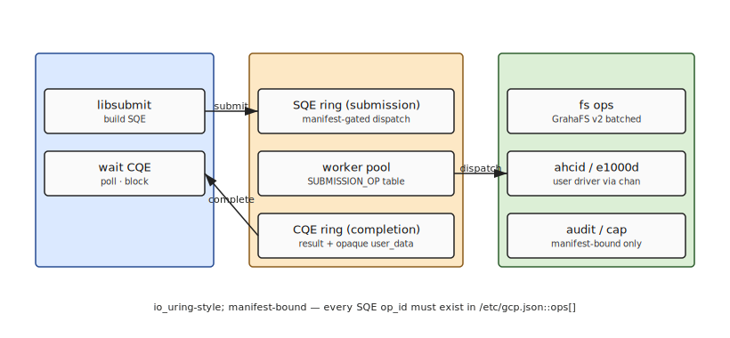
</p>

Async I/O without a thread pool. Submission Queue Entry / Completion Queue Entry rings, mapped via shared VMO between caller and worker, dispatched through the manifest. Semantics are intentionally close to io_uring (Axboe 2019), but every dispatch is capability-gated and the available op set is whatever `/etc/gcp.json` declares. `stream_reap` loops internally until `min_complete` or deadline. [`kernel/io/stream.c`](kernel/io/stream.c)

### Scheduler & SMP

<p align="center">
  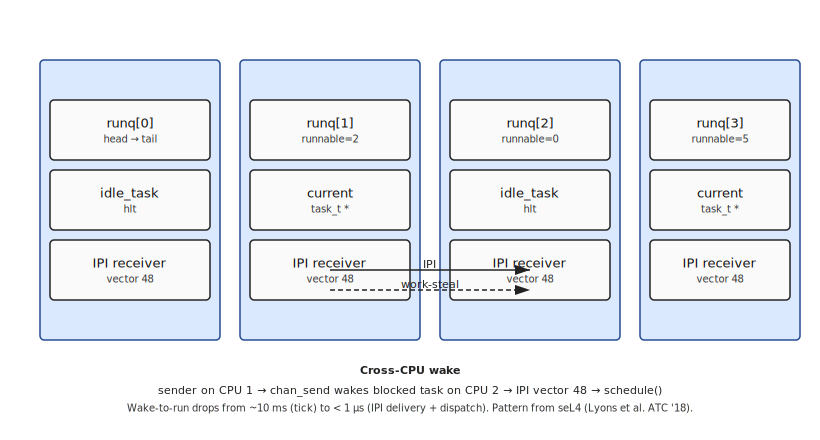
</p>

Per-CPU runqueues with work-stealing, seL4-style cross-CPU IPI doorbell on wake (`sched_maybe_doorbell_ipi`), `INT 49` same-CPU yield, starvation detection. `sched_block_on_channel` / `sched_wake_one_on_channel` is the canonical IPC wait/wake pair. The scheduler skips `ZOMBIE` tasks at runq dequeue so `SIGKILL` is deterministic. The SMP bring-up at boot uses INIT-SIPI-SIPI; APs join with a per-CPU `runq_t` that takes a thread on first `schedule()`. [`arch/x86_64/cpu/sched/sched.c`](arch/x86_64/cpu/sched/sched.c), [`arch/x86_64/cpu/smp.c`](arch/x86_64/cpu/smp.c)

### GrahaFS v2 — Versioned Segments

<p align="center">
  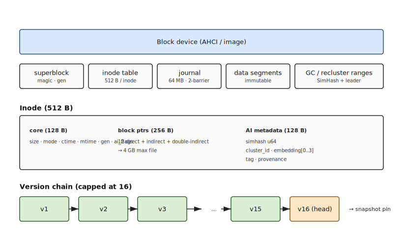
</p>

512-byte inodes with direct + indirect + double-indirect pointers (4 GB max file size), 64 MB journal with two-barrier protocol (transaction begin → write → commit → fsync), version chains per inode capped at 16 entries, immutable-once-written segments with background GC, and **AI metadata at the inode level** — every inode carries a 128-dimension embedding slot (with `embedding[0]` holding the 64-bit SimHash) plus a 4-byte cluster ID. Sequential Leader Clustering (Hamming threshold τ=10) groups files in-memory at mount time. [`kernel/fs/grahafs_v2.c`](kernel/fs/grahafs_v2.c), [`kernel/fs/journal.c`](kernel/fs/journal.c), [`kernel/fs/cluster.c`](kernel/fs/cluster.c)

### Snapshots — COW Process State

<p align="center">
  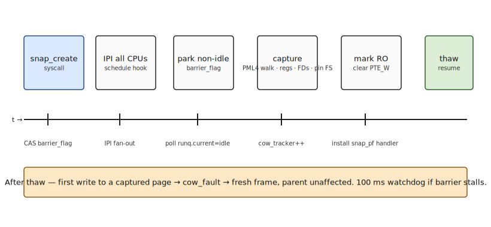
</p>

A snapshot is a barrier-synchronised capture of one or more processes' state. `snap_begin_barrier` does an atomic CAS + IPI broadcast, polls each CPU's runq for `current==idle_task`, with a 100 ms TSC watchdog → `-ETIME`. Inside the barrier, `snap_walk_user_half` deep-walks the user-half PML4 of every in-scope task, bumps a per-physical-page COW tracker + `pmm_page_ref`, records `(virt, phys, flags)`, and clears `PTE_WRITABLE` so subsequent writes COW into fresh pages. `snap_capture_fs_pins_for_task` walks the task's FD table and calls `grahafs_pin_version` for every open file inode. Channels in the freeze set are walked under `g_chan_reg_lock` and have their endpoints flipped to a `frozen_at_snap` state that returns `-EFROZEN` from `chan_send`/`chan_recv`. Restore replays per-page `(virt, phys, flags)` into the live CR3, restores regs/FDs/pledge for non-caller tasks, and reverts grahafs version chains. [`kernel/snap/`](kernel/snap/)

### Transactional Speculation

<p align="center">
  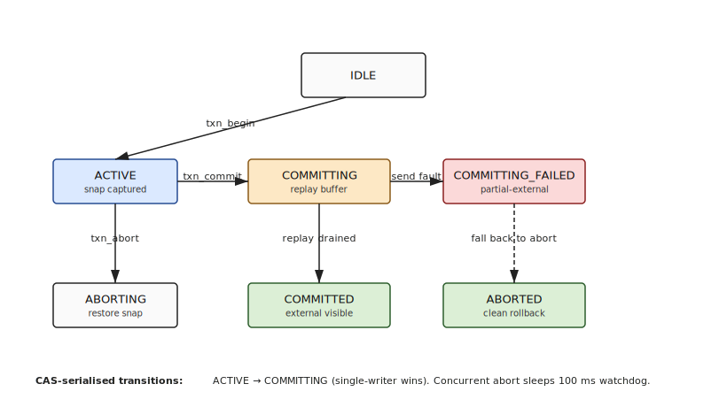
</p>

Transactions wrap snapshots with external-effect buffering. `txn_begin` takes a snapshot and seeds a per-transaction VMO ring (lazy-allocated 4 MiB default, magic-bookended `BEADF00D`/`DEADC0DE` records). Inside the transaction, `chan_send` to a peer outside the transaction's scope is *buffered* — the message goes into the ring instead of the live channel. On `commit`, the ring is drained via a replay engine that sets `caller->replay_in_progress=1` so the prologue doesn't re-buffer; on `abort`, the ring is freed and the snapshot is restored. State transitions (`ACTIVE→COMMITTING→COMMITTED`, `ACTIVE→ABORTING→ABORTED`, `COMMITTING_FAILED→ABORTING`) use `__atomic_compare_exchange_n` for serialisation, with a per-transaction waitqueue + 100 ms watchdog so an abort racing a commit-in-flight either wins (if `COMMITTING_FAILED`) or sees `-EALREADY`. Up to 4 transactions nest. [`kernel/txn/transaction.c`](kernel/txn/transaction.c), [`kernel/txn/buffer.c`](kernel/txn/buffer.c), [`kernel/txn/replay.c`](kernel/txn/replay.c)

### Wasmtime + GCP-as-WIT

<p align="center">
  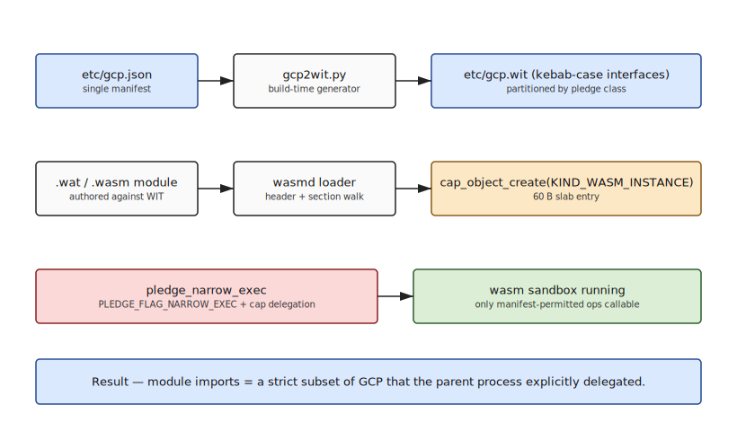
</p>

WebAssembly hosting via [wasm3](https://github.com/wasm3/wasm3) vendored at [`vendor/wasm3/`](vendor/wasm3/). The `wasmd` daemon publishes `/sys/wasm/control` via libnet, accepts `RUN_MODULE` requests, drives wasm3 `ParseModule`/`LoadModule`/`LinkRawFunction(gcp.print)`/`FindFunction(_start)`/`CallV`, captures stdout via the `host_gcp_print` shim, and reports per-call summary back to the client. Hand-rolled fixture modules ship in the initrd (`hello.wasm`, `oopsie.wasm` for trap testing, `long_running.wasm`, `fn_call_bench.wasm`, `demo_net.wasm`). The `grahai wasm-run <path>` verb runs a module end-to-end and reports the audit-event delta. **Capability narrowing is post-spawn**: `SYS_PLEDGE` with `PLEDGE_FLAG_NARROW_EXEC` shrinks both the pledge mask and the capability set the child inherits, so a WASM module can be granted `IPC_SEND` to one specific channel and nothing else. [`user/wasmd/wasmd.c`](user/wasmd/wasmd.c)

### Userspace Drivers

<p align="center">
  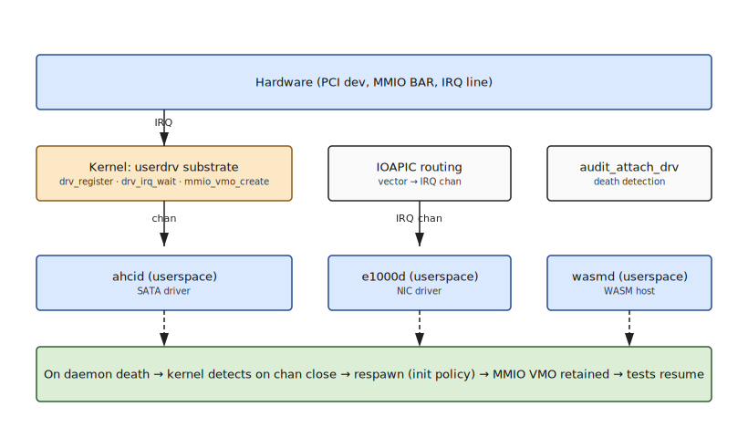
</p>

`drv_register` / `drv_irq_wait` / `mmio_vmo_create` is the substrate. A driver process registers an IRQ vector with the kernel, gets back an SPSC IRQ ring (with coalesced doorbell — one wake per IRQ batch), and maps device MMIO via a VMO. **`e1000d`** drives the Intel 82540EM in userspace, leaving only minimal capability glue in the kernel. **`ahcid`** drives SATA via AHCI; the kernel side keeps just enough to expose the HBA and orchestrate respawn. The respawn pattern: when `ahcid` dies, `init` re-spawns it and `ahci_restore_after_userdrv_death` recovers HBA state without losing in-flight requests.

### Network Stack

The in-tree network daemon `netd` implements RFC-faithful Eth/ARP/IPv4/ICMP/UDP/TCP-Reno/DHCP/DNS in userspace. Client-facing surface is `libnet` (sockets), `libhttp` (request/response), `libtls-mg` (TLS shim). The `wasmd` daemon, the `grahai` agent, and the `wasm` CLI all consume `libnet`. Source: [`user/netd.c`](user/netd.c) plus [`user/drivers/netd_*.c`](user/drivers/).

### TUI Framework + Virtual Consoles

Frame compositing, keyboard/mouse routing, four virtual consoles (Alt+1..Alt+4), 256-colour xterm-compatible palette, 11 Unicode box-drawing glyphs, sprite cells, RGBA bitmap overlays. The `libtui` userspace library provides `tui_init`/`tui_attach`/`tui_clear`/`tui_write_cell`/`tui_print`/`tui_draw_box`/`tui_set_cursor`/`tui_present`. The `fbd` compositor is the substrate for graphical-mode applications. [`kernel/console/console.c`](kernel/console/console.c), [`user/libtui/`](user/libtui/), [`user/fbd/fbd.c`](user/fbd/fbd.c).

### Audit & Observability

256-byte audit records, 55 event types (capability derive/revoke, pledge narrow, transaction begin/commit/abort, snapshot create/delete, syscall rate-limit, plan-step, …), on-disk daily rotation at UTC, queryable via `SYS_AUDIT_QUERY`. `SYS_AUDIT_SUBSCRIBE` (1110) + `SYS_AUDIT_STREAM_READ` (1111) give a process a 64-entry SPSC ring of live events — used by `grahai` to stream agent activity for replay. Distinct from `klog`, which is the in-memory lossy debug ring used during boot/panic. [`kernel/audit.c`](kernel/audit.c)

---

## Build & Run

### Prerequisites (Fedora 40+)

```bash
sudo dnf install gcc-c++ make git nasm bison libelf-devel xorriso qemu \
                 python3 python3-pyyaml
```

You also need an `x86_64-elf` cross-toolchain (GCC 15.x + Binutils 2.x with gold). The build expects it at `/home/atman/GrahaOS/toolchain/bin/x86_64-elf-{gcc,ld,as}`. Build instructions from the [OSDev wiki cross-compiler page](https://wiki.osdev.org/GCC_Cross-Compiler) work as-is.

### Build, run, test

```bash
git clone https://github.com/B-Divyesh/GrahaOS.git
cd GrahaOS

# Build the kernel + userspace + ISO
make clean
make

# Run interactively under QEMU (drops into gash)
make qemu-interactive

# Run the full TAP gate (KVM-accelerated by default; falls back to TCG
# if /dev/kvm is absent or GRAHAOS_TEST_NO_KVM=1 is set)
make test

# Prove the harness catches a deliberate failure
make test-sentinel-meta

# Reformat the AHCI disk image (required after FS on-disk format changes)
make reformat
```

### Useful gsh (the GrahaOS shell) commands

```text
gsh> caps                    # list this process's held capabilities
gsh> pledge ipc_send,fs_read # narrow this process's pledge mask
gsh> snapshot                # create a snapshot, print the handle
gsh> snapshots               # list active snapshots
gsh> restore <handle>        # restore from a snapshot handle
gsh> txn { ... } commit      # transactional region with explicit commit
gsh> txn { ... } abort       # … or abort
gsh> ifconfig                # netd interfaces
gsh> ping 1.1.1.1            # in-tree ICMP
gsh> simhash <path>          # 64-bit fingerprint of a file
gsh> similar <path>          # files within Hamming distance 10
gsh> clusters                # cluster table
gsh> grahai wasm-run /etc/wasm/hello.wasm   # run a wasm module
gsh> ktest <name>            # run a single TAP test interactively
```

---

## Repository Tour

```
GrahaOS/
├── arch/x86_64/            CPU, MMU, drivers (boot-side), interrupts, syscall entry
│   ├── cpu/                sched, smp, syscall, interrupts
│   ├── mm/                 PMM, VMM
│   └── drivers/            keyboard, ioapic, lapic_timer, e1000, ahci
├── kernel/                 OS-agnostic kernel core
│   ├── cap/                tokens, objects, handle_table, pledge, audit, CAN, system, wasm
│   ├── ipc/                channels, manifest blob, rawnet
│   ├── mm/                 VMO
│   ├── fs/                 GrahaFS v2, journal, segment, GC, simhash, cluster, pipe, blk_client
│   ├── snap/               snapshot, capture, restore, barrier, cow_fault, chan_freeze
│   ├── txn/                transaction, buffer, replay
│   ├── io/                 submission streams (SQE/CQE)
│   ├── console/            virtual consoles, sprites, gfx overlay
│   ├── driver/             userdrv substrate (drv_register/IRQ ring)
│   ├── resource/           rlimits + token-bucket I/O
│   ├── audit.c             audit log, subscriber rings
│   └── main.c              kmain
├── user/                   userspace
│   ├── init.c              PID 1
│   ├── gash.c              shell
│   ├── grahai.c            AI agent CLI
│   ├── wasmd/              WebAssembly host daemon (wasm3 inside)
│   ├── netd.c              TCP/IP daemon
│   ├── drivers/            e1000d, ahcid, netd_*
│   ├── libnet/ libhttp/ libtls-mg/ libtui/ libdriver/
│   ├── ktest.c             TAP harness front-end
│   └── tests/              TAP test binaries
├── vendor/wasm3/           wasm3 (MIT)
├── etc/                    gcp.json (the manifest), gcp.wit (generated), init.conf
├── scripts/                run_tests.sh, parse_tap.py, gcp2wit.py,
│                           gen_manifest_blob.py, gen_wasm_fixtures.py, mkfs.gfs.c
├── specs/                  YAML specs + schema.yml
├── docs/
│   ├── GRAHAOS-COMPREHENSIVE-REPORT.md   technical report
│   └── diagrams/           SVG figures
├── ACTIVATION_ARCHITECTURE.md   the original CAN design document
└── README.md               this file
```

---

## Reading List

- **[`ACTIVATION_ARCHITECTURE.md`](ACTIVATION_ARCHITECTURE.md)** — the original CAN design document.
- **[`specs/`](specs/)** — YAML specs (kernel structs, syscalls, manual verification steps); primary source for any subsystem.
- **[`specs/MANUAL_VERIFICATION_PLAYBOOK.md`](specs/MANUAL_VERIFICATION_PLAYBOOK.md)** — aggregated end-to-end manual walkthrough.
- **[`docs/GRAHAOS-COMPREHENSIVE-REPORT.md`](docs/GRAHAOS-COMPREHENSIVE-REPORT.md)** — full technical report (architecture, literature review, novel contributions, appendices).

Academic foundations cited heavily across the design: seL4 (Klein et al. 2009), KeyKOS (Hardy 1985), Capsicum (Watson 2010), OpenBSD pledge, Plan 9 Venti (Quinlan 2002), TxOS (Porter 2009), io_uring (Axboe 2019), WebAssembly Component Model + WASI Preview-2.

---

## Contributing

Please open issues against [github.com/B-Divyesh/GrahaOS](https://github.com/B-Divyesh/GrahaOS) for design discussion before starting work.

---

## Author

GrahaOS — kernel, userspace, filesystem, network stack, capability/channel substrate, snapshot/transaction primitives, WebAssembly host, TUI framework, test harness, specs, and the comprehensive technical report at [`docs/GRAHAOS-COMPREHENSIVE-REPORT.md`](docs/GRAHAOS-COMPREHENSIVE-REPORT.md) — is designed and written by **Divyesh Bine** ([@B-Divyesh](https://github.com/B-Divyesh)).

This is a from-scratch single-author project: every line of the kernel, the userspace, and the test harness was written by hand in this tree (with the sole exception of the vendored `wasm3` interpreter under [`vendor/wasm3/`](vendor/wasm3/), MIT-licensed and used unmodified for the WebAssembly substrate). No code is forked from another OS.

---

## Final Thoughts

GrahaOS is a project of passion, vision, and experimentation. It represents a deliberate rethinking of what an operating system can be when designed *for* AI rather than *alongside* it — capability-first, manifest-driven, speculation-native, and verified end-to-end by hand and by harness.

**Contributors welcome.**
